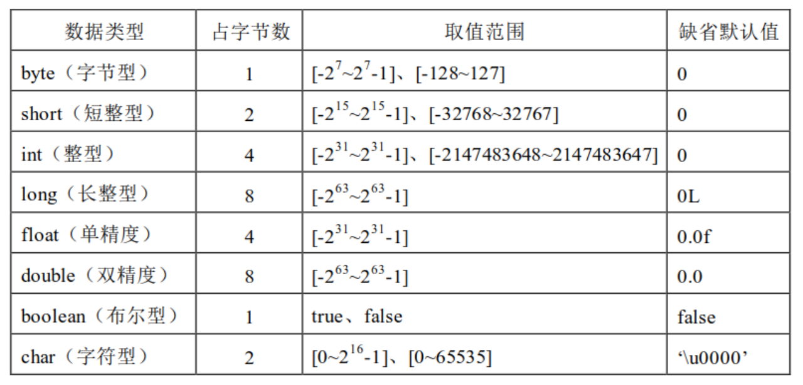

# 第3章 Java基础语法

## 3.1 注释

（1）单行注释 `//注释内内`

（2）多行注释 `/* 注释内容 */`

（3）文档注释  `/** 注释内容 */`

## 3.2 public class与class区别

（1）一个类在声明的过程中，我们需要使用的是class关键字

这个class关键字的前面，可以加public关键字进行修饰/也可以不加

从我们当前的测试来看，加不加这个public关键字，对于编译和运行来讲没有任何区别，但是二者之间在一些特殊情况下是有区别的，而这些区别也是将来在笔试过程中的考点。

（2）如果一个类使用public修饰，文件名必须要与类名保持一致，否则编译报错。

（3）如果一个类没有使用public修饰，则文件名可以与类名不一致，当编译成功后会自动的生成对应 类名的.class文件，然后我们可以正常的运行该.class文件。

（4）在一个Java源文件中可以编写任意多个类，当编译成功后自动的生成对应类的个数的.class文件，并且可以分别的运行这些.class文件。

（5）如果在一个Java源文件中编写了多个类，则最多只能有一个类可以使用public进行修饰。这个public所修饰的类只能是与文件名名称一致的类。

注意：

在实际项目开发中，以后我们在创建类的时候一定要把public给加上（养成要习惯）。而且在实战中，同一份Java源文件中，只创建一个类

一份.java文件  对应一个Java类

## 3.3 标识符

## 标识符的命名规则

- 标识符可以由 字母 数字 _ $ 构成
- 数字不能开头
- 区分大小写
- 不能使用关键字

## 标识符的命名规范

- 见名知意
- 驼峰命名
- 类名、接口名首字母大写，后面每个单词首字母大写
- 变量名、方法名、首字母小写，后面每个单词首字母大写
- 常量名全部大写，下划线分割

## 3.5 变量

### 3.5.1 字面量

字面量就是数值。例如：1234、true、“abc”、“中国”、3.14。现实生活中能接触的数据。

### 3.5.2 变量

存放数据且数据可变

### 变量的分类

1、 变量按声明的位置(作用范围)分为

- 局部变量：在方法中声明的
- 成员变量：在方法外声明的，也就是在类中声明的变量

2、 变量按数据类型分为

- 基本数据类型变量：在内存中存放真正的值，如：int、double、char……..
- 引用数据类型变量：在内存中存放的是地址，如：String……

###  基本数据类型

基本数据类型又包括4 类8 种：

- 第1 类：整数型（不带小数的数字）：byte,short,int,long
- 第2 类：浮点型（带小数的数字）：float,double
- 第3 类：字符型（文字，单个字符）：char
- 第4 类：布尔型（真和假）：boolean

常见的 ASCII 码需要大家能够记住几个，在 ASCII 码中规定

'a'对应 97，'b'对应98，以此类推，'A'对应65，'B'对应66，以此类推，'0'字符对应48，'1'字符对应49，以此类推，这些常见的编码还是需要大家记住的。

### 3.8 数据类型详解

### 3.8.1 字符类型的应用

字符类型：char ‘ ’

字符型char 在 Java 语言中占用 2 个字节，char 类型的字面量必须使用半角的单引号括起来，取值范围为[0-65535]，char 和short 都占用2 个字节，但是char 可以取到更大的正整数，因为char 类型没有负数。

练习：

（1）创建char类型的变量，赋值普通字符，并打印变量值。

（2）创建char类型的变量，赋值数字，并打印变量值。

（3）创建char类型的变量，结合任意转义字符并打印变量值。

char c1 = ‘a’;

char c2 = 97;

char c3 = ‘\”’;

### 3.8.2 整数类型的应用

### 浮点数类型的应用

### 3.8.4 基本数据类型转换

### 3.8.5 布尔类型的应用

## 3.9 IDEA使用

模块在工程中创建，一个工程中可以创建任意多个模块

注意：1.包在src目录下创建或在指定的包中创建

​		2.包名建议编写单词，并且全部小写

## 3.10 package包

(1) 将java资源进行分类管理

(2) 区分重名的资源

### 3.10.2 包的创建

- 包存放在src目录下或者指定的包中

 创建包有两种方式：

第一种方式：先创建包，再创建类

第二种方式：可以在创建类的同时建立包

包名建议编写单词，并且全部小写

如果一个类在指定的包中存放，则类中的第一行必须是包的声明，否则该类就存放在src目录下

声明包的语法格式：package 包名;

包名也可以编写为域名反写，每一个”.”表示一层路径

注意：

​	未来的实际项目开发，肯定会伴随着创建N多个java资源，我们一定是建立包结构去管理这些资源的。所以从今天开始，同学们一定要先建立包，在包中建立类。

### 3.10.3 包的导入

正在开发中的当前类，很有可能会使用到其他包下的类，那么我们就必须要对其他包下的类进行导包操作。

导入包的方式有如下：

- 第一种方式：import 包名.类名;

- 第二种方式：import 包名.*;

- 第三种方式：在使用时编写完整类名，也就是 包名.类名

我们常用的是前两种方式

注意：在一个类中如果有包的声明也有导入包，则声明必须位于导入的前面

