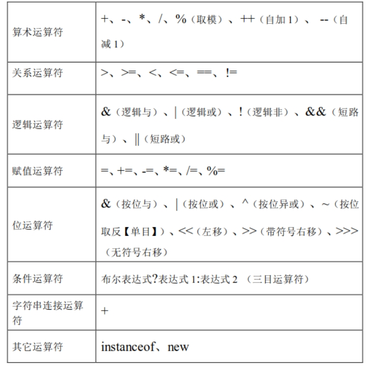
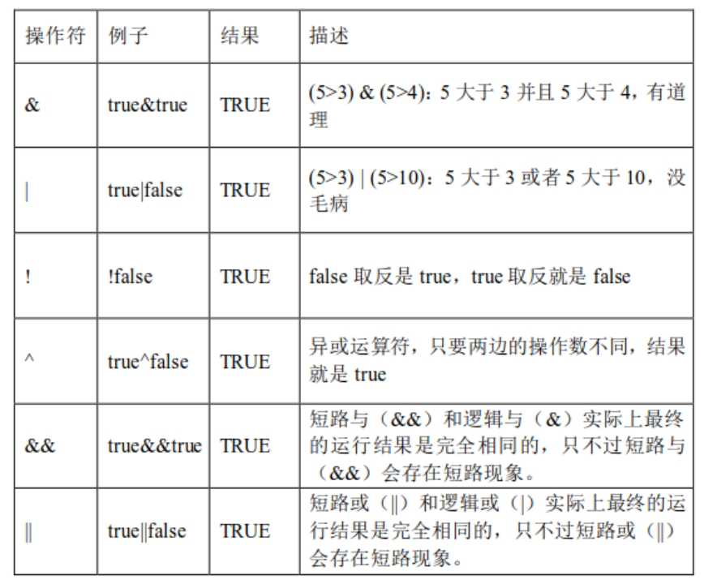
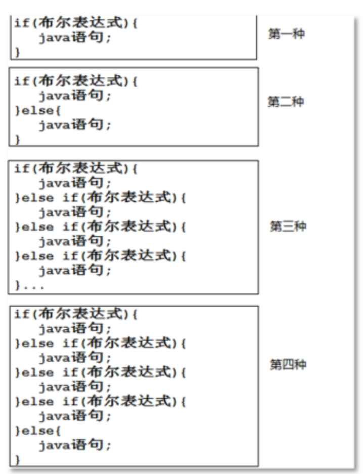
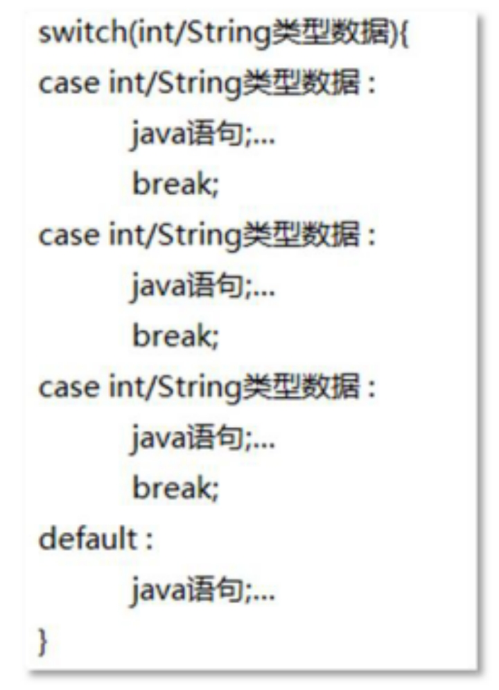
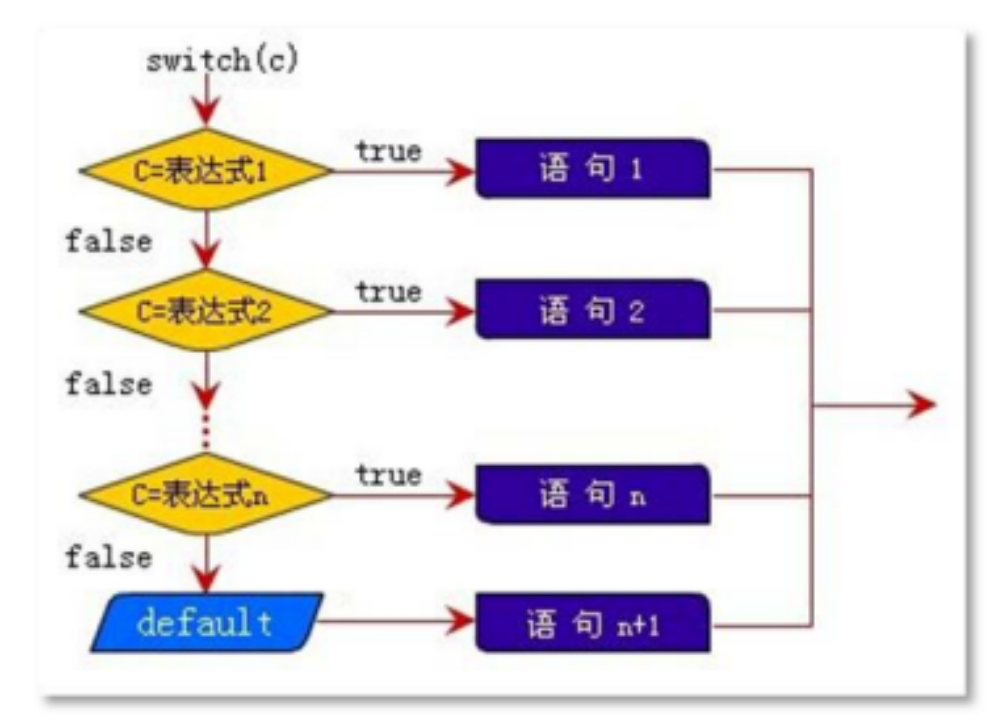
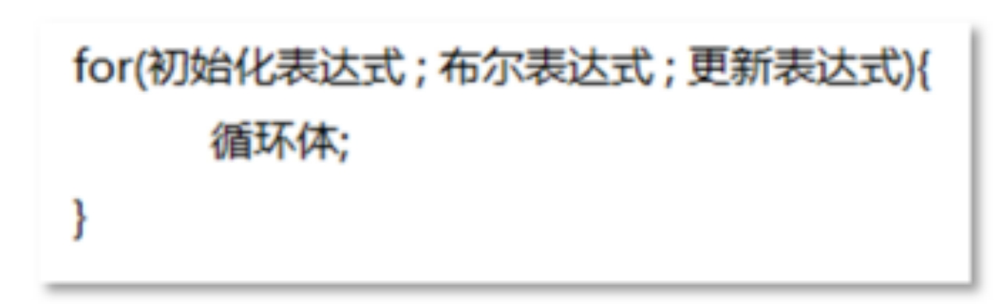
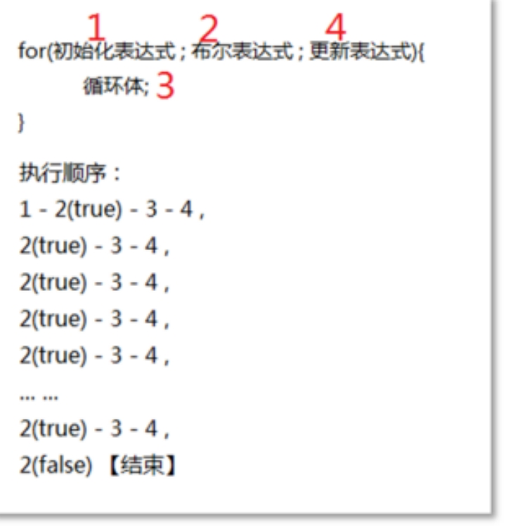
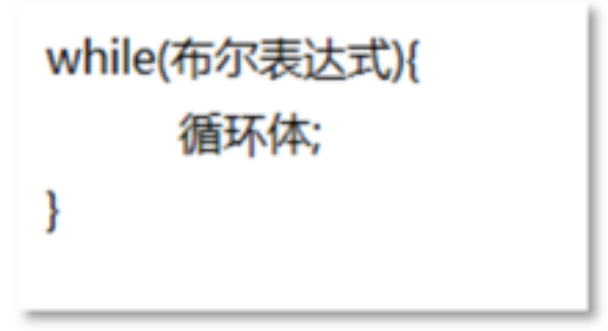
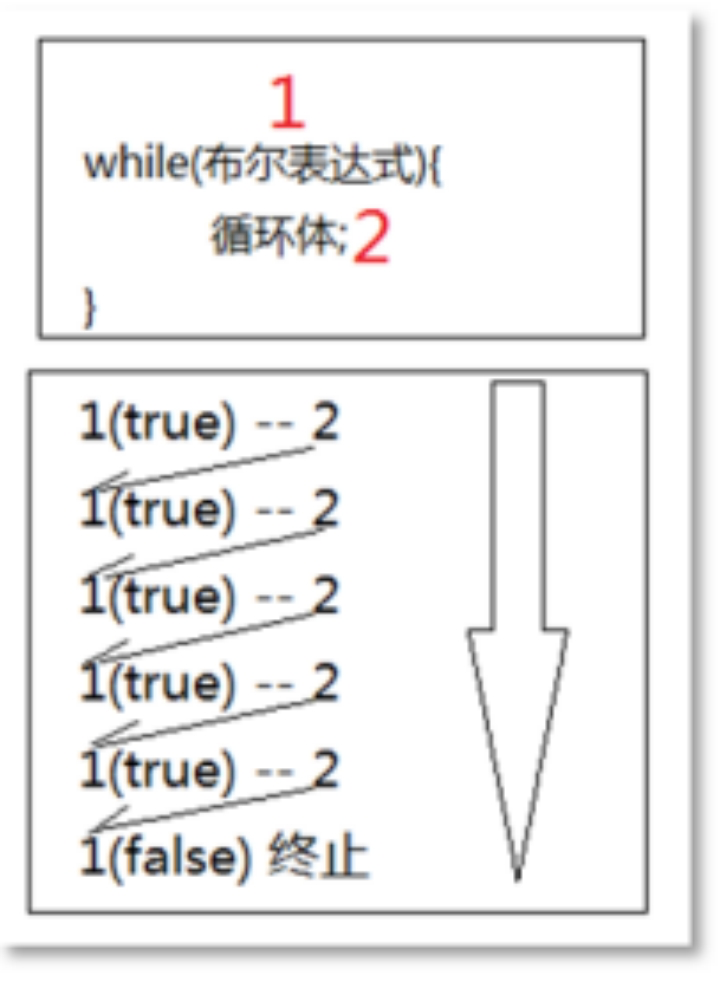

# 第4章 运算符与控制语句

## 4.1 运算符

### 4.1.1 运算符概述

运算符是指对操作数的运算方式。

组成表达式的Java 操作符有很多种（什么是操作数和操作符，例如1+2，其中1 和2 都是操作数，+是操作符，操作符和操作数联合起来构成表达式）。

按其功能来分，有算术运算符、赋值运算符、关系运算符、逻辑运算符、位运算符、条件运算符、字符串连接运算符和其他运算符。

常见的运算符如下所示：

### 4.1.2 算数运算符

算术运算符包括：+（两个数字求和）、-（两个数字相减）、*（两个数字乘积）、/（两个数字相除）、%（两个数字取模或者求余）、++（对数字自加 1）、--（对数字自减 1）。

### 4.1.3 关系运算符

关系运算符主要是完成数据和数据之间的比较，比如：5>3，结果是 true（真），5>10，结果是 false（假）。

关系运算符 ：

\>、>=、<、<=、==、!=

### 4.1.4 逻辑运算符

逻辑运算符主要包括逻辑与（&），逻辑或（|），逻辑异或（^），短路与（&&），短路或（||）。所有逻辑运算符的特点是操作数都是布尔类型，并且最终的运算结果也是布尔类型。

逻辑运算符的基本运算规则如下表所示：

### 4.1.5 赋值运算符

赋值运算符目前也是只需要掌握=、+=、-=、*=、/=、%=，其它和二进制相关的内容也是到后面遇到的时候再详细学习。赋值类的运算符包括基本赋值运算符（=）和扩展的赋值运算符（+=、-=、*=、/=、%=）。

### 4.1.6 优先级

这么多的运算符，它们同时出现的时候有优先级吗？答案是有的。那么如果不确定它们的优先级怎么办，其实很简单，***\*直接加小括号就可以了\****，添加有小括号优先级一定是高的，所以优先级不需要死记硬背，不确定就加小括号，例如：1 + 2 * 3，想确保先求和，你就需要这样写：(1+2)*3。

### 4.1.7 条件运算符

条件运算符我们经常称之为***\*三目运算符\****（三元运算符），它的语法结构是：布尔表达式?表达式1:表达式2。它的运行原理是这样的，先判断布尔表达式的结果是true 还是false，如果是true，则选择表达式1 的结果作为整个表达式的结果，反之则选择表达式2 的结果作为整个表达式的结果。

###  4.1.8 字符串拼接符

字符串拼接符的符号就是加号“+”,实际上“+”运算符在java 语言中有两个作用，作用一是对数字进行求和运算，作用二就是字符串连接运算。

在java 语言中所有的字符串都使用***\*半角\****双引号括起来的，字符串属于引用数据类型，不属于基本数据类型的范畴，怎么定义一个字符串的变量呢？例如：String name = “jack”;，这就类似于int i = 10;是一样的，int 是一种整数类型，i 是变量，10 是整数型字面量。那么String 则是一种字符串类型，name 是变量，”jack”是字符串型字面量。在 java 编程中对字符串的操作是非常频繁的，例如字符串的连接操作，此时就需要使用“+”字符串连接运算符了。 

## 4.2 控制语句

在大部分编程语言当中都会存在控制语句，控制语句是一个程序的灵魂，我们只依靠“标识符、关键字、变量、运算符”等零散的知识点是无法进行流程控制的，无法实现一个具体的功能或业务，所以控制语句这一章节非常重要。

现实生活中哪些业务需要使用控制语句呢？比如说“小孩身高如果高于1.2 米，则乘坐交通工具就需要收费了，反之则免费”，再比如“A 账户向 B 账户转账 10000 元，首先需要判断A 账户的余额是否大于等于10000 元，如果余额充足则可以转账，不足则无法转账”等等，这些业务当中都需要使用控制语句进行控制才能完成。

### 4.2.1 选择语句 if

选择语句又称为分支语句，它通过对给定的条件进行判断，从而决定执行两个或多个分支中的哪一支。因此，在编写选择语句之前，应该首先明确判断条件是什么，并确定当判断结果为“真”或“假”时应分别执行什么样的操作/算法。

在Java 语言中选择语句主要提供了两个，一个是if 语句，另一个则是switch 语句。

我们先来看if 语句，if 语句的编写方式归纳为以下四种

if 语句是非常简单容易理解的，if 被翻译为”如果”，else 被翻译为”其它”，我们针对以上第二种写法进行说明：如果布尔表达式的结果是“真”，则执行它后面的分支，反之则执行 else对应的分支。

### 4.2.2 选择语句 switch

switch 语句和if 语句一样，都属于选择语句（分支语句），不再赘述，我们直接来看一下一个比较完整的switch 语句结构是怎样的。

switch语句的运行原理

switch 运行原理文字性描述是这样的（以上图为例）：拿着c 和表达式1 进行比较，如果相等，则执行语句1，如果不相等，继续拿着c 和表达式2 进行比较，如果相等，则执行语句2，如果不相等，继续...，如果c 和所有的分支表达式都不相等，此时default 分支“语句n+1”则执行。

使用switch语句你需要知道的三件事：

（1）switch 语句后面的小括号“()”当中都可以出现什么，在JDK1.6 之前（包括1.6 在内）switch 只能探测int 类型的数据，但是在JDK1.7 之后（包括1.7 在内），switch 语句除了支持int 类型之外，还支持 String 类型。也就是说从 Java7 开始 switch 后面小括号中可以出现字符串。 

（2）switch 虽然只能探测int 类型，但是也可以byte,short,char 类型放到小括号当中，因为这些类型会自动转换成int 类型（小容量向大容量转换称为自动类型转换）。

（3）switch 语句当中当某个分支匹配成功，则开始执行此分支当中的java 语句，当遇到当前分支中的“***\*break\****;”语句，switch 语句就结束了，但是如果当前分支中没有“break;”语句，则会发生 case ***\*穿透\****现象，也就是说下一个分支也不再进行匹配，直接进入下一个分支执行，直到遇到“break;”为止。

总结：

​	if 和 switch 都是条件判断语句（分支语句/选择语句）,在效果上是没有什么差别的。

而不同的是,我们可以从效率上来看一看，举一个很简单的例子： if(a > b) { a = b;} else { b = a; } 如果将这个例子放在 switch 语句中，也并不是不能实现，但是实现起来可能会比较麻烦一些，因为在switch 语句中case 要求的是常量，一般是不能进行逻辑判断的，所以这也是if 语句优于switch语句的地方。

但是如果您判断的都是几个常量的数据，建议最好采用 switch 语句，虽然if 语句也是能实现的，但是性能就比switch 差的有点远了。

### 4.2.3 循环语句 for

在不少实际问题中有许多具有规律性的重复操作，因此在程序中就需要重复执行某些语句。一组被重复执行的语句称之为循环体，能否继续重复，取决于循环的终止条件。循环结构是在一定条件下反复执行某段程序的流程结构，被反复执行的程序被称为循环体。循环语句是由循环体及循环的终止条件两部分组成的。

假设现在有这样的业务需求：输出100 行“hello world!”， 那么代码“System.out.println("hello world!")”这行代码重复出现，直到输出100 个为止。显然程序应该找一种更好的实现方式，这个时候我们就可以借助java 语言中的循环语句来实现了。

java 中的循环语句共包括三个，分别是：for 循环、while 循环、do..while 循环。

​	我们先来学习for循环。

​	语法格式如下图所示：

对以上 for 循环语法结构进行说明：初始化表达式最先执行，并且在整个循环当中初始化表达式只执行一次，布尔表达式结果是 true 或者 false，true 表示循环可以继续执行，false 表示循环结束，循环体当中的代码就是需要反复执行的代码，更新表达式一般是用来更新某个变量的值，更新操作之后可能布尔表达式的结果就不再是true 了。

原理如下图所示：

### 4.2.4 循环语句 while

循环语句除了for 循环之外还有while 和do..while，接下来我们先来看一下while 循环~，首先学习while 循环的语法结构

通过上图可以看出 while 循环的语法结构非常简单，它的执行顺序以及原理是这样的，先判断布尔表达式的结果，如果是true，则执行循环体，循环体结束之后，再次判断布尔表达式的结果，如果是true，再执行循环体，循环体结束之后，再判断布尔表达式的结果，直到结果为false 的时候，while 循环结束。如果起初第一次判断布尔表达式结果的时候就是false，那么while 循环体执行次数就为0 了。

​	执行原理如图所示：

关于for循环和while循环的小结：

实际上 while 循环可以看做是 for 循环的另一种变形写法，本质上是一样的，执行效率上也是一样的，硬要说它们有什么不同的话，首先while 循环语法结构比for 更简单，for 循环的计数器比while 更清楚一些，另外for 循环的计数器对应的变量可以在for 循环结束之后就释放掉，但是 while 循环的计数器对应的变量声明在 while 循环外面，扩大了该变量的作用域。总之，不管是for 还是while，大家都必须掌握，因为这两个循环使用最多。

### 4.2.5  循环语句 do...while

do..while 循环是while 循环的变形，它们的区别在于do..while 循环可以保证循环体执行次数至少为1 次，也就是说 do..while 循环的循环体执行次数是1~N 次，它有点儿先斩后奏的意思，而while 循环的循环体执行次数为0~N 次。

​	我们一起来看看do..while 循环的语法结构，以及执行顺序。

while循环和do…while循环小结：

while 和do..while 循环的区别就在于do..while 会先执行一次循环体，然后再判断条件，这样do..while 的循环体至少执行一次。而while 循环则是先判断条件是否合法，如果不合法，则循环体就没有任何执行的机会。while 循环体执行次数是0~N 次，但是do..while 循环体执行次数则是1~N 次。

### 4.2.6  转向语句 break

转向语句用于实现循环执行过程中程序流程的跳转，在Java 中转向语句有break 和continue语句。当然，还包括其它的，例如return 语句，这里主要给大家说一下break 和continue 语句。

​	使用break 这一个单词就可以在java 语言中自成一条java 语句，break 语句的编写很简单，例如“break;”，那么它可以用在哪里呢？首先它可以使用在switch 语句当中，用来终止switch语句的执行，这个之前我们用过，这里不再赘述，break 语句重点是使用在循环语句当中，用来终止/跳出循环。

### 4.2.7 转向语句 continue

continue 语句也是单个单词自成一条java 语句，例如“continue;”，它和break 语句都是用来控制循环的，break 语句是用来终止循环的执行，而 continue 语句则是用来终止当前本次循环，直接进入下一次循环继续执行。

## 4.3 Debug的作用

在实际项目开发中，我们总会遇到程序执行错误的情况，即便是经验再丰富的程序员，也不可能保证每一次敲的代码都能够顺利执行。那么使用高级开发工具中的Debug机制就是一种很好的调试错误的手段。

使用Debug机制调试错误的原理，就是在我们所需要的指定的代码位置打上”***\*断点\****”，当程序执行的过程中，会在断点处暂停，然后我们通过手动操作，让程序按照我们指定的方式去继续执行。

对于我们正在使用的IDEA工具，当然也提供了Debug调错的机制。

#### 4.4 Scnner类使用

我们之前一直是在控制台做运行结果的输出操作，为了配合控制语句的练习，我们现在要学习使用键盘输入相关的操作。

在Java程序中，键盘输入操作我们需要使用Scanner类来实现。

使用Scanner类如以下步骤所示：

（1）导入包，必须位于当前Java源文件所有类的最前面

​		import java.util.Scanner;

​		注意：在一个Java源文件中只需要编写一次导入包即可

（2）创建Scanner对象

​		Scanner input = new Scanner(System.in);

​		注意：在一个方法中只需要编写一次创建Scanner对象

​		关于对象我们还没有学到，暂时先了解使用方式即可

（3）友好提示

​		System.out.println("请输入：");

（4）接收键盘输入

int a = input.nextInt();  //注意：当按回车键，则表示键盘输入完毕，并且将回车之前输入的内容赋给左侧变量名称

​		double d = input.nextDouble();

String a = input.next();   //注意：在java中，如果键盘接收字符串类型时，没有nextString(),而是使用next()

 

